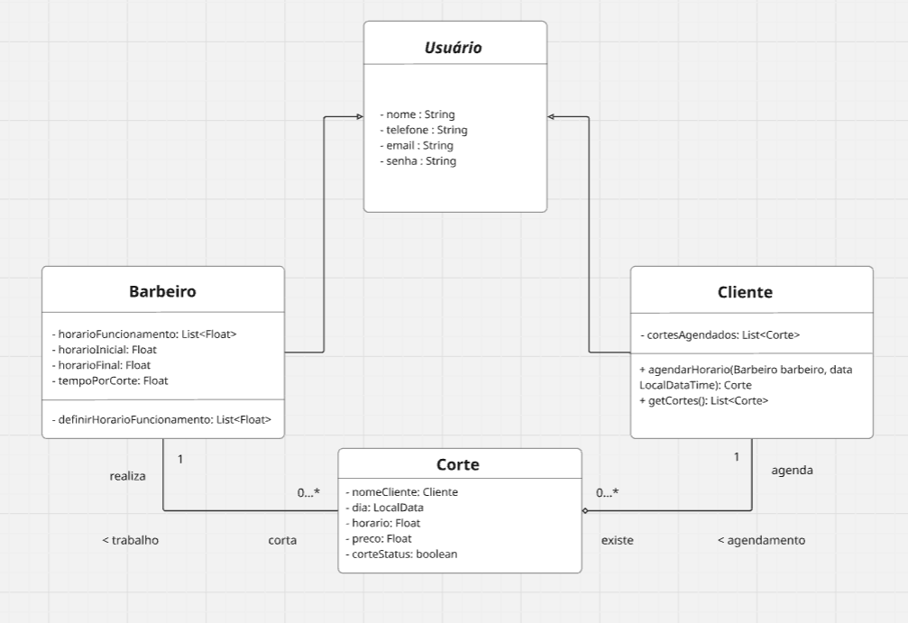
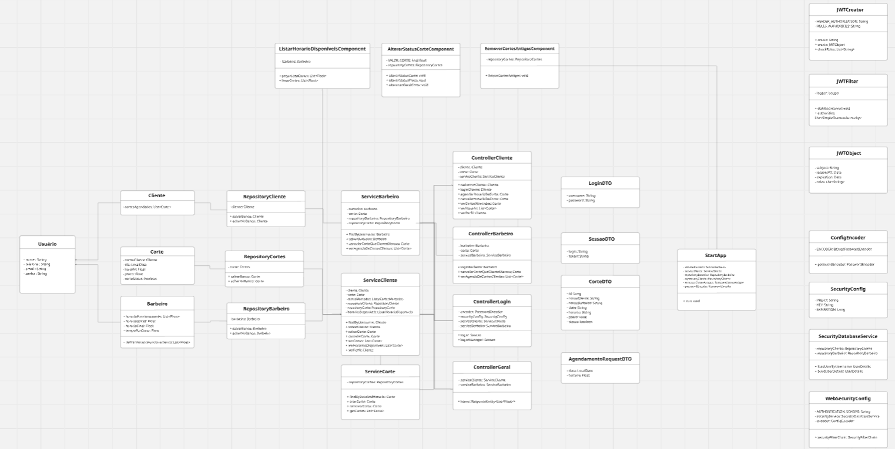
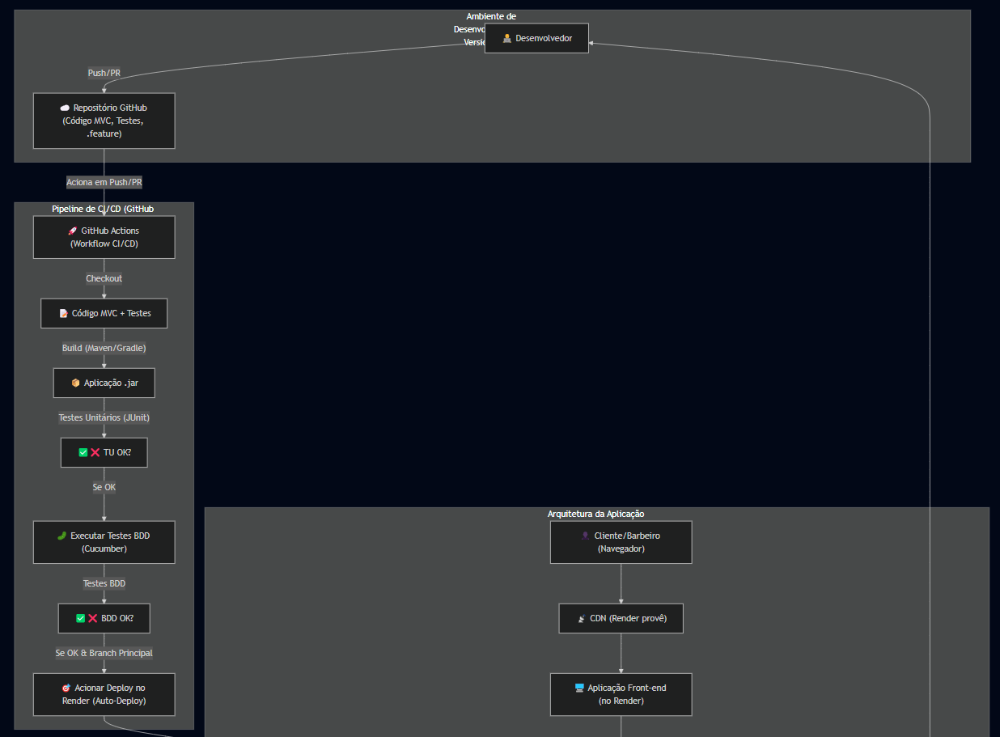
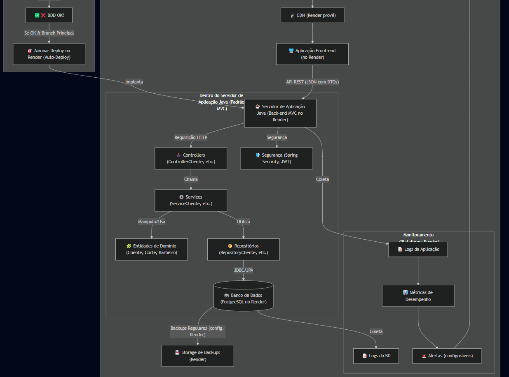

# ✂️ **JavaCortando - Sistema de Agendamento para Barbearias**

## 📌 Descrição
**JavaCortando** é um sistema desenvolvido para facilitar o agendamento de cortes de cabelo em barbearias.  
O projeto visa modernizar o processo de marcação de horários, permitindo que clientes façam reservas online, editem ou cancelem compromissos, além de gerenciar seus perfis de forma intuitiva.

---

## 🔗 Links do Projeto

  

  

---

## 🚀 Deploy do Projeto

🔗 Acesse: [Projeto rodando na Render](https://front-projeto-poo.onrender.com/)

---

## 🧑🏻‍💻 Documentação de Como Rodar a Aplicação

(Em construção)

---

## 📃 Entregas

### 📦 Entrega 1
- 🎥 [Vídeo no YouTube](https://youtu.be/8Q1tQ8D2EZQ?si=sDhOYCMUrof_788Q)
- 📋 [Histórias de usuário no Trello](https://trello.com/invite/b/67db31973176211a647f7134/ATTI70be2f70dd5fde3bf304746c8d65367a25D5ED40/trabalho-programacao-orientada-a-objeto-barbearia)

---

### 📦 Entrega 2
- ✅ Entrega via commit das 2 histórias definidas no Trello.
- 📊 Diagrama de classes:
  

---

### 📦 Entrega 3
- ✅ Entrega via commit de 3 histórias, testes, diagramas e vídeo screencast.
- 📊 Diagrama de classes:
  
- 🎥 [Vídeo das atualizações](https://youtu.be/7tUJrM01ImM)

---

### 📦 Entrega 4
- ✅ Entrega via commit de 3 histórias, testes, diagramas e vídeo screencast.
- 📊 Diagramas de classes:
  
  
- 🎥 Link para vídeo das atualizações: _[Em breve]_

---

## 🌐 Autores

<table>
  <tr>
    <td align="center">
      <a href="https://github.com/DavidaMendes">
         
        <b>Davi Mendes</b>
      </a>
    </td>
    <td align="center">
      <a href="https://github.com/giulms">
         
        <b>Giulliano Lucas</b>
      </a>
    </td>
    <td align="center">
      <a href="https://github.com/GustavoLino728">
         
        <b>Gustavo Lino</b>
      </a>
    </td>
    <td align="center">
      <a href="https://github.com/ItaloVasconcelos05">
         
        <b>Ítalo Artur</b>
      </a>
    </td>
    <td align="center">
      <a href="https://github.com/henryzera">
         
        <b>Emanuel Henry</b>
      </a>
    </td>
    <td align="center">
      <a href="https://github.com/brittola">
         
        <b>Gabriel Rodrigues</b>
      </a>
    </td>
  </tr>
</table>

---

### Feito com ❤️ por:

- Davi Mendes  
- Giulliano Lucas  
- Gustavo Lino  
- Ítalo Artur  
- Emanuel Henry  
- Gabriel Rodrigues

---
